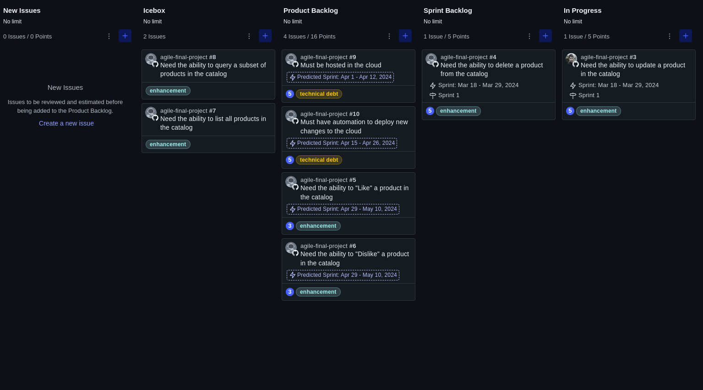

# Agile Final Project

](https://opensource.org/license/mit) 

This is the final project of the course "Introduction to Agile Development and Scrum" by IBM.

## Description

This project consist of a ZenHub kanbam board an a GitHub repository to practice the creation of user stories,
assembling them into a product backlog, refining them to produce a sprint plan, and perform a mock sprint that 
involves moving stories across the kanban boards as a team would do in a real sprint.

## Usage

- Create a new repository on GitHub.
- Create a new workspace on ZenHub and link it to the repository.
- Create all the issues according to the project instructions.

## Final Result

The final result of Kanbam board should be something like this:

## License

Copyright (c) 2024, Guilherme Oliveira. All rights reserved.

Licensed under the MIT License. See [LICENSE](LICENSE)